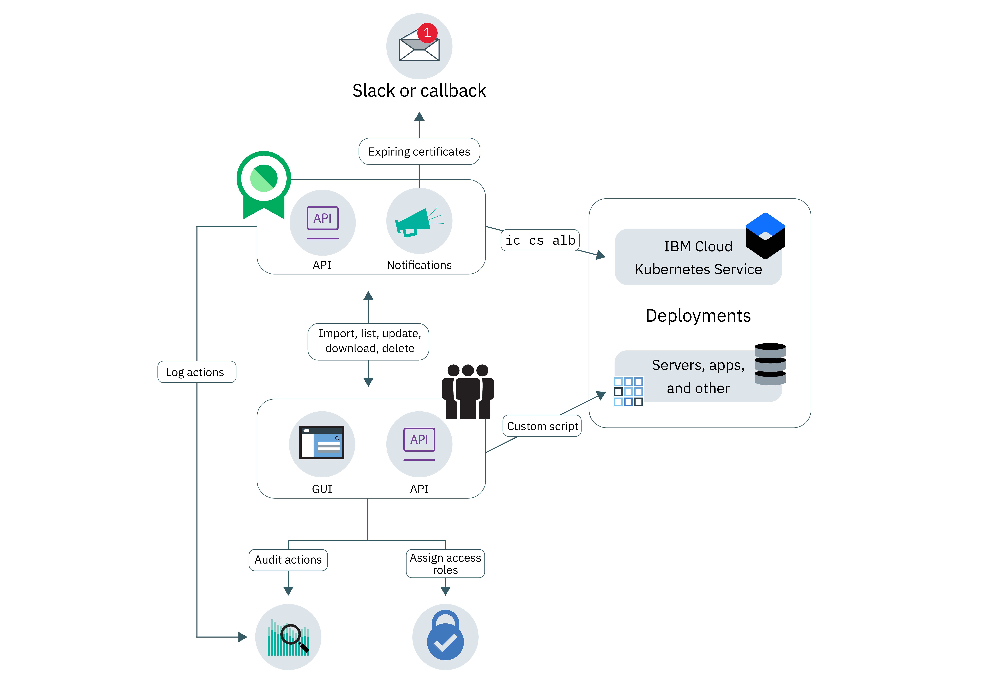

---

copyright:
  years: 2017, 2018
lastupdated: "2018-07-30"

---
{:new_window: target="_blank"}
{:shortdesc: .shortdesc}
{:screen: .screen}
{:codeblock: .codeblock}
{:pre: .pre}

# About Certificate Manager
{: #about-certificate-manager}

{{site.data.keyword.cloudcerts_short}} helps you to manage the SSL certificates for your {{site.data.keyword.IBM_notm}} cloud-based apps and services.
{: shortdesc}

You can import SSL certificates that you obtain for your apps and services, store them securely, and get a central view of the certificates that you are using.

You can manage your certificates in the following ways:

* Get notified before your certificates expire to ensure that you renew them on time
* View the types of certificates across your deployments and ensure that they meet organization policies
* Find certificates that need replacing when new compliance or security requirements are issued
* Set controls on who can access and manage your certificates

<caption> Diagram 1. High-level service architecture.</caption>

## Private key security
{: #private-key-security}

When you import a certificate and the corresponding private key into {{site.data.keyword.cloudcerts_short}}, the service uses an Advanced Encryption Standard (AES) 256 algorithm to encrypt the private key. {{site.data.keyword.cloudcerts_short}} saves this unique encrypted key to use with your service instance.

## Integrations
{: #integrations}
<table>
<caption> Table 1. IBM Cloud services that use Certificate Manager</caption>
  <tr>
    <th> Service </th>
    <th> Description </th>
  </tr>
  <tr>
    <td>{{site.data.keyword.containerlong_notm}}</td>
    <td>Store your Kubernetes cluster custom domain certificates in Certificate Manager, then deploy them using [Kubernetes Service plug-in commands](/docs/containers/cs_cli_reference.html) for the IBM Cloud CLI. [Learn more about this integration](https://www.ibm.com/blogs/bluemix/2018/01/use-ibm-cloud-certificate-manager-ibm-cloud-container-service-deploy-custom-domain-tls-certificates/).</td>
  </tr>
  <tr>
    <td>IBM Cloud Security Advisor</td>
    <td>Security Advisor centralizes the insights of IBM Cloud services, including indication of expired and about-to-expire certificates in instances of Certificate Manager in your IBM Cloud account. [Learn more about Security Advisor](/docs/services/security-advisor/index.html#index)</td>
  </tr><tr>
    <td>{{site.data.keyword.cloudaccesstrailfull_notm}}</td>
    <td>Use the {{site.data.keyword.cloudaccesstrailfull}} service to track how users and applications interact with the {{site.data.keyword.cloudcerts_long}} service in the {{site.data.keyword.Bluemix}}. [Learn more about {{site.data.keyword.cloudaccesstrailshort}}](/docs/services/cloud-activity-tracker/index.html#getting-started-with-cla).
    
To get the list of actions that generate an event, see [{{site.data.keyword.cloudaccesstrailshort}} events](/docs/services/certificate-manager/at_events.html#at_events).
</td>
  </tr>
</table>

## Regions availability
{: #availability}

{{site.data.keyword.cloudcerts_short}} is available in the US-South region only.

