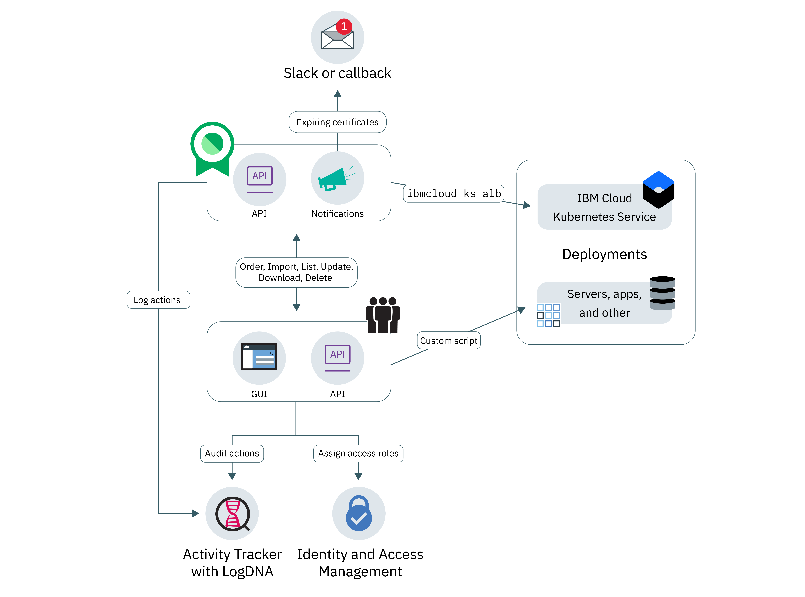

---

copyright:
  years: 2017, 2018
lastupdated: "2018-11-15"

---

{:new_window: target="_blank"}
{:shortdesc: .shortdesc}
{:screen: .screen}
{:pre: .pre}
{:table: .aria-labeledby="caption"}
{:codeblock: .codeblock}
{:tip: .tip}
{:download: .download}

# About {{site.data.keyword.cloudcerts_short}}
{: #about-certificate-manager}

{{site.data.keyword.cloudcerts_long}} helps you to manage the SSL certificates for your {{site.data.keyword.IBM_notm}} cloud-based apps and services.
{: shortdesc}

You can import SSL certificates that you obtain for your apps and services, store them securely, and get a central view of the certificates that you are using.

You can manage your certificates in the following ways:

* Get notified before your certificates expire to ensure that you renew them on time
* View the types of certificates across your deployments and ensure that they meet organization policies
* Find certificates that need replacing when new compliance or security requirements are issued
* Set controls on who can access and manage your certificates

<caption>Figure 1. High-level service architecture.</caption>

## Private key security
{: #private-key-security}

When you import a certificate and the corresponding private key into {{site.data.keyword.cloudcerts_short}}, the service uses an Advanced Encryption Standard (AES) 256 algorithm to encrypt the private key. {{site.data.keyword.cloudcerts_short}} saves this unique encrypted key to use with your service instance.

## Integrations
{: #integrations}

<table>
<caption>{{site.data.keyword.cloud_notm}} services that use {{site.data.keyword.cloudcerts_short}}</caption>
  <tr>
    <th> Service </th>
    <th> Description </th>
  </tr>
  <tr>
    <td>{{site.data.keyword.containerlong_notm}}</td>
    <td>Store your Kubernetes cluster custom domain certificates in {{site.data.keyword.cloudcerts_short}}, then deploy them using [Kubernetes Service plug-in commands](/docs/containers/cs_cli_reference.html) for the {{site.data.keyword.cloud_notm}} CLI. [Learn more about this integration ](https://www.ibm.com/blogs/bluemix/2018/01/use-ibm-cloud-certificate-manager-ibm-cloud-container-service-deploy-custom-domain-tls-certificates/).</td>
  </tr>
  <tr>
    <td>{{site.data.keyword.security-advisor_full_notm}}</td>
    <td>{{site.data.keyword.security-advisor_short}} centralizes the information about {{site.data.keyword.cloud_notm}} services. The information includes the indication of expired certificates and certificates that are about to expire in instances of {{site.data.keyword.cloudcerts_short}} in your {{site.data.keyword.cloud_notm}} account. [Learn more about {{site.data.keyword.security-advisor_short}}](/docs/services/security-advisor/index.html#index).</td>
  </tr>
  <tr>
    <td>{{site.data.keyword.cloudaccesstrailfull_notm}}</td>
    <td>Use the {{site.data.keyword.cloudaccesstrailfull_notm}} service to track how users and applications interact with the {{site.data.keyword.cloudcerts_long_notm}} service in the {{site.data.keyword.cloud_notm}}. [Learn more about {{site.data.keyword.cloudaccesstrailshort}}](/docs/services/cloud-activity-tracker/index.html#getting-started-with-cla).
    
To get the list of actions that generate an event, see [{{site.data.keyword.cloudaccesstrailshort}} events](/docs/services/certificate-manager/at_events.html#at_events).
</td>
  </tr>
  <tr>
    <td>{{site.data.keyword.cloud_notm}} {{site.data.keyword.apiconnect_short}}</td>
    <td>Store your custom domain certificates in the {{site.data.keyword.cloudcerts_short}} service, then use certificate CRNs to bind with custom domains in {{site.data.keyword.apiconnect_short}}. [Learn more about {{site.data.keyword.apiconnect_short}}](/docs/api-management/index.html#index).
</td>
  </tr>
</table>

## Locations
{: #availability}

{{site.data.keyword.cloudcerts_short}} is available in the Dallas and London locations.

## Limits
{: #limits}

You can upload a maximum of 1000 certificates per instance.
