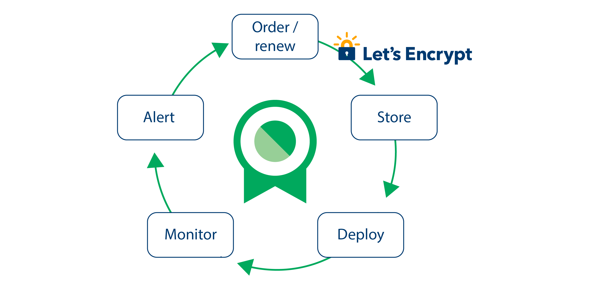

---

copyright:
  years: 2017, 2019
lastupdated: "2019-09-19"

keywords: certificates, SSL, life cycle, certificate, cert,

subcollection: certificate-manager

---

{:external: target="_blank" .external}
{:shortdesc: .shortdesc}
{:screen: .screen}
{:pre: .pre}
{:table: .aria-labeledby="caption"}
{:codeblock: .codeblock}
{:tip: .tip}
{:note: .note}
{:important: .important}
{:deprecated: .deprecated}
{:download: .download}

# Key concepts
{: #key-concepts}

Learn about the concepts that are associate with certificates and how {{site.data.keyword.cloudcerts_full}} can help.
{: shortdesc}

## Certificate life cycle
{: #life-cycle}

Check out the following image and descriptions to see how {{site.data.keyword.cloudcerts_short}} can help you manage the life cycle of your certificates.

{: caption="Figure 1. How {{site.data.keyword.cloudcerts_short}} helps you to manage the life cycle of your certificates" caption-side="bottom"}

<dl>
  <dt>Order</dt>
    <dd>With {{site.data.keyword.cloudcerts_short}}, you can order free SSL and TLS certificates through Let's Encrypt. If you already have a certificate authority that you prefer, you can bring your own certificate to the service.</dd>
  <dt>Store</dt>
    <dd>When you order a certificate through {{site.data.keyword.cloudcerts_short}}, it is automatically stored for you. If you bring your own certificate, you can easily import it into the service. You can track both internal and external certificates in one place. You can also securely store both your certifcates and keys.</dd>
  <dt>Deploy</dt>
    <dd>When you need to use your certificate, you can automate the deployment to SSL or TLS termination points by integrating {{site.data.keyword.cloudcerts_short}} with  DevOps processes in cloud native environments. You can also use the <a href="/docs/services/containers?topic=containers-getting-started">IBM Cloud Kubernetes Service</a>. CLI to easily deploy certificates from {{site.data.keyword.cloudcerts_short}}.</dd>
  <dt>Monitor and Alert</dt>
    <dd>The service continuously monitors your certificates for their expiration dates to notify you of upcoming expiring certificates and other life cycle events such as reimports, orders, or renews through Slack or Callback URLs. If you have alerts coming from more than one service, it can be helpful to integrate with <a href="/docs/services/security-advisor?topic=security-advisor-getting-started">IBM Cloud Security Advisor</a> to manage all of your alerts in one place.</dd>
  <dt>Renew</dt>
    <dd>With {{site.data.keyword.cloudcerts_short}}, you can configure your certificates to be automatically renewed. When your certficate is renewed, the cycle begins again.</dd>
</dl>

## Examples
{: #life-cycle-examples}

* [How to Use {{site.data.keyword.cloudcerts_short}} to Avoid Outages Using Callback URLs - Part 1](https://www.ibm.com/cloud/blog/use-certificate-manager-avoid-outages-using-callback-urls){: external}
   Learn how to create GitHub issues for expiring certificate notifications.
* [How to Use {{site.data.keyword.cloudcerts_short}} to Avoid Outages Using Callback URLs - Part 2](https://www.ibm.com/cloud/blog/how-to-use-certificate-manager-to-avoid-outages-using-callback-urls-part-2){: external}
   Learn how to create PagerDuty incidents for expiring certificate notifications.
* [How to Automate TLS Certificate Rotation to Avoid Outages](https://www.ibm.com/cloud/blog/how-to-automate-tls-certificate-rotation-to-avoid-outages){: external}
   Learn how to automate certificate rotation for expiring certificates.  
* [How to validate a domain by using a Callback URL and a Cloud Function action)](https://www.ibm.com/cloud/blog/use-ibm-cloud-certificate-manager-to-obtain-lets-encrypt-tls-certificates-for-your-public-domains){: external}
   Learn how to validate your domain ownership when ordering certificates.
