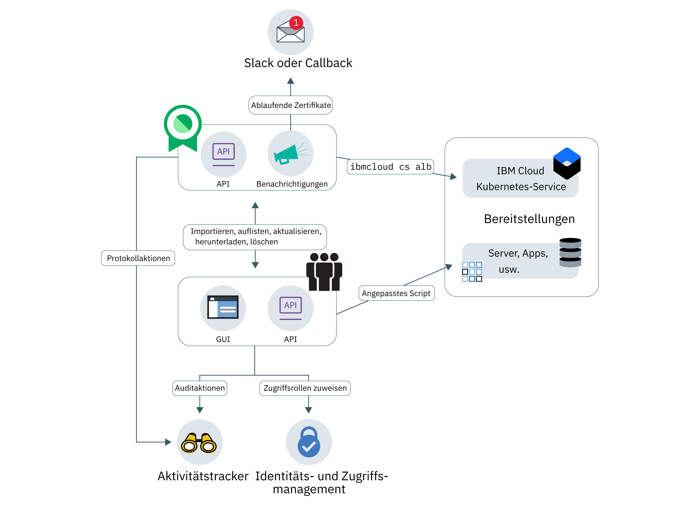

---

copyright:
  years: 2017, 2018
lastupdated: "2018-08-02"

---
{:new_window: target="_blank"}
{:shortdesc: .shortdesc}
{:screen: .screen}
{:codeblock: .codeblock}
{:pre: .pre}

# Informationen zu Certificate Manager
{: #about-certificate-manager}

{{site.data.keyword.cloudcerts_short}} unterstützt Sie bei der Verwaltung der SSL-Zertifikate für Ihre {{site.data.keyword.IBM_notm}} Cloud-basierten Apps und Services.
{: shortdesc}

Sie können SSL-Zertifikate, die Sie von Ihren Apps und Services empfangen, importieren und sicher speichern und Sie erhalten eine zentrale Übersicht über die Zertifikate, die Sie verwenden.

Sie können Ihre Zertifikate auf folgende Art und Weise verwalten:

* Benachrichtigung vor dem Ablauf von Zertifikaten erhalten und so eine rechtzeitige Verlängerung sicherstellen
* Zertifikatstypen über verschiedene Bereitstellungen hinweg anzeigen und die Einhaltung der Richtlinien der Organisation sicherstellen
* Zertifikate suchen, die ersetzt werden müssen, wenn neue Konformitäts- und Sicherheitsanforderungen in Kraft treten
* Mechanismen einrichten, die steuern, wer auf Ihre Zertifikate zugreifen und wer sie verwalten kann

<caption>Allgemeine Servicearchitektur</caption>

## Schutz privater Schlüssel
{: #private-key-security}

Wenn Sie ein Zertifikat und den entsprechenden privaten Schlüssel in {{site.data.keyword.cloudcerts_short}} importieren, verwendet der Service einen AES 256-Algorithmus zum Verschlüsseln des privaten Schlüssels (AES = Advanced Encryption Standard). {{site.data.keyword.cloudcerts_short}} speichert diesen eindeutigen verschlüsselten Schlüssel zur Verwendung mit Ihrer Serviceinstanz.

## Integrationen
{: #integrations}
<table>
<caption>IBM Cloud-Services, die Certificate Manager nutzen</caption>
  <tr>
    <th> Service </th>
    <th> Beschreibung </th>
  </tr>
  <tr>
    <td>{{site.data.keyword.containerlong_notm}}</td>
    <td>Speichern Sie Ihre angepassten Domänenzertifikate für Kubernetes-Cluster in Certificate Manager und stellen Sie sie dann mithilfe der [Kubernetes-Service-Plug-in-Befehle](/docs/containers/cs_cli_reference.html) für die IBM Cloud-Befehlszeilenschnittstelle bereit. [Weitere Informationen zu dieser Integration finden Sie hier](https://www.ibm.com/blogs/bluemix/2018/01/use-ibm-cloud-certificate-manager-ibm-cloud-container-service-deploy-custom-domain-tls-certificates/).</td>
  </tr>
  <tr>
    <td>IBM Cloud Security Advisor</td>
    <td>Security Advisor fasst die Informationen der IBM Cloud-Services, einschließlich der Meldungen zu abgelaufenen oder demnächst ablaufenden Zertifikaten in Certificate Manager-Instanzen, in Ihrem IBM Cloud-Konto zusammen. [Weitere Informationen zu Security Advisor finden Sie hier](/docs/services/security-advisor/index.html#index).</td>
  </tr><tr>
    <td>{{site.data.keyword.cloudaccesstrailfull_notm}}</td>
    <td>Mit dem {{site.data.keyword.cloudaccesstrailfull}}-Service können Sie die Interaktionen von Benutzern und Anwendungen mit dem {{site.data.keyword.cloudcerts_long}}-Service in {{site.data.keyword.Bluemix}} verfolgen. [Weitere Informationen zu {{site.data.keyword.cloudaccesstrailshort}} finden Sie hier](/docs/services/cloud-activity-tracker/index.html#getting-started-with-cla).
    
Eine Liste der Aktionen, die ein Ereignis generieren, finden Sie in [{{site.data.keyword.cloudaccesstrailshort}}-Ereignisse](/docs/services/certificate-manager/at_events.html#at_events).
</td>
  </tr>
</table>

## Regionen
{: #availability}

{{site.data.keyword.cloudcerts_short}} steht nur in er Region 'Vereinigte Staaten (Süden)' zur Verfügung.

