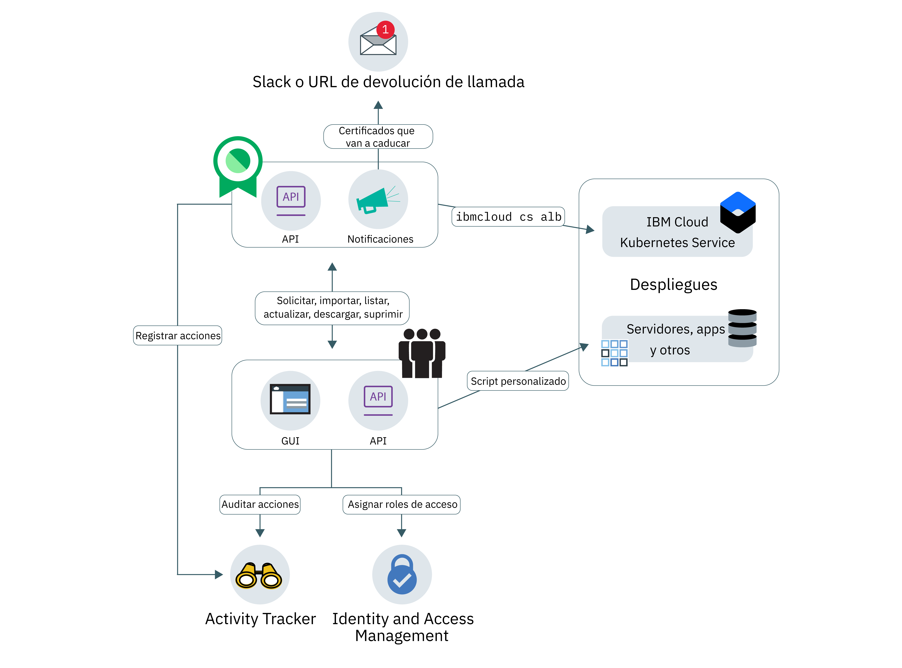

---

copyright:
  years: 2017, 2018
lastupdated: "2018-08-21"

---

{:new_window: target="_blank"}
{:shortdesc: .shortdesc}
{:screen: .screen}
{:pre: .pre}
{:table: .aria-labeledby="caption"}
{:codeblock: .codeblock}
{:tip: .tip}
{:download: .download}

# Acerca de Certificate Manager
{: #about-certificate-manager}

{{site.data.keyword.cloudcerts_short}} le ayuda a gestionar los certificados SSL para las apps y los servicios basados en la nube de {{site.data.keyword.IBM_notm}}.
{: shortdesc}

Puede importar certificados SSL que obtenga para las apps y los servicios, almacenarlos de forma segura, y obtener una vista central de los certificados que está utilizando.

Puede gestionar los certificados de las formas siguientes:

* Recibir notificaciones de caducidad de certificados para poder renovarlos a tiempo
* Ver los tipos de certificados en los despliegues y asegurarse de que cumplan las políticas de organización
* Buscar certificados que necesiten sustitución cuando se emitan nuevos requisitos de conformidad o de seguridad
* Establecer controles sobre quién puede acceder y gestionar sus certificados

<caption>Arquitectura de servicio de alto nivel.</caption>

## Seguridad de clave privada
{: #private-key-security}

Al importar un certificado y la correspondiente clave privada en {{site.data.keyword.cloudcerts_short}}, el servicio utilizará un algoritmo Advanced Encryption Standard (AES) 256 para cifrar la clave privada. {{site.data.keyword.cloudcerts_short}} guarda esta clave cifrada exclusiva para utilizarla con la instancia de servicio.

## Integraciones
{: #integrations}
<table>
<caption>Servicios de IBM Cloud que utilizan Certificate Manager</caption>
  <tr>
    <th> Servicio </th>
    <th> Descripción </th>
  </tr>
  <tr>
    <td>{{site.data.keyword.containerlong_notm}}</td>
    <td>Almacene sus certificados de dominio personalizado de clúster de Kubernetes en Certificate Manager y, a continuación, despliéguelos utilizando los [mandatos del plugin del servicio Kubernetes](/docs/containers/cs_cli_reference.html) para la CLI de IBM Cloud. [Más información sobre esta integración](https://www.ibm.com/blogs/bluemix/2018/01/use-ibm-cloud-certificate-manager-ibm-cloud-container-service-deploy-custom-domain-tls-certificates/).</td>
  </tr>
  <tr>
    <td>IBM Cloud Security Advisor</td>
    <td>Security Advisor centraliza la información de valor de los servicios de IBM Cloud, incluida la indicación de certificados caducados o a punto de caducar en instancias de Certificate Manager de su cuenta de IBM Cloud. [Más información sobre Security Advisor](/docs/services/security-advisor/index.html#index)</td>
  </tr><tr>
    <td>{{site.data.keyword.cloudaccesstrailfull_notm}}</td>
    <td>El servicio {{site.data.keyword.cloudaccesstrailfull}} permite rastrear la forma en la que usuarios y aplicaciones interactúan con el servicio {{site.data.keyword.cloudcerts_long}} en {{site.data.keyword.Bluemix}}. [Aprenda más sobre {{site.data.keyword.cloudaccesstrailshort}}](/docs/services/cloud-activity-tracker/index.html#getting-started-with-cla).
    
Consulte [Sucesos de {{site.data.keyword.cloudaccesstrailshort}}](/docs/services/certificate-manager/at_events.html#at_events) para obtener una lista de las acciones que generan un suceso.
</td>
  </tr>
</table>

## Regiones
{: #availability}
{{site.data.keyword.cloudcerts_short}} está disponible en las regiones EE.UU. sur y Reino Unido.

