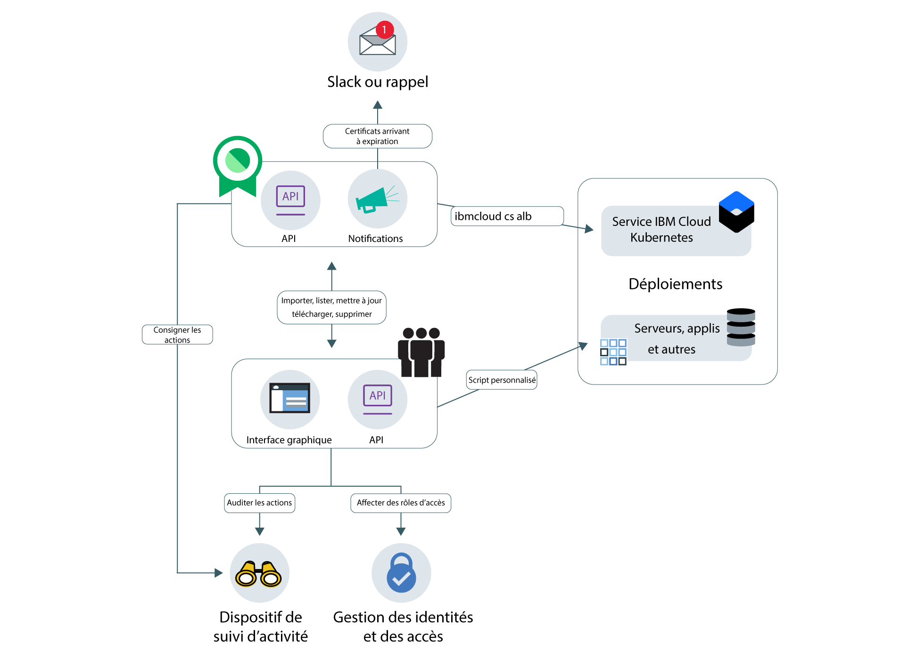

---

copyright:
  years: 2017, 2018
lastupdated: "2018-11-15"

---

{:new_window: target="_blank"}
{:shortdesc: .shortdesc}
{:screen: .screen}
{:pre: .pre}
{:table: .aria-labeledby="caption"}
{:codeblock: .codeblock}
{:tip: .tip}
{:download: .download}
# A propos de {{site.data.keyword.cloudcerts_short}}
{: #about-certificate-manager}

{{site.data.keyword.cloudcerts_long}} vous permet de gérer les certificats SSL pour vos applications et vos services cloud {{site.data.keyword.IBM_notm}}.
{: shortdesc}

Vous pouvez importer des certificats SSL que vous obtenez pour vos applications et vos services, les stocker en toute sécurité et centraliser l'affichage des certificats que vous utilisez.

Vous pouvez gérer vos certificats en procédant comme suit :

* Soyez averti avant l'expiration de vos certificats pour être sûr de pouvoir les renouveler à temps.
* Affichez les types de certificats sur vos déploiements et assurez-vous qu'ils répondent aux politiques de l'organisation.
* Recherchez les certificats que vous devez remplacer lorsque de nouvelles exigences de conformité ou de sécurité sont émises.
* Définissez les contrôles qui déterminent qui peut accéder à et gérer vos certificats.

<caption>Figure 1. Architecture de haut niveau du service.</caption>

## Sécurité de clé privée
{: #private-key-security}

Lorsque vous importez un certificat et la clé privée correspondante dans {{site.data.keyword.cloudcerts_short}}, le service utilise un algorithme AES (Advanced Encryption Standard) 256 pour chiffrer la clé privée. {{site.data.keyword.cloudcerts_short}} sauvegarde cette clé chiffrée unique à utiliser avec votre instance de service.

## Intégrations
{: #integrations}

<table>
<caption>Tableau 1. Services {{site.data.keyword.cloud_notm}} qui utilisent {{site.data.keyword.cloudcerts_short}}</caption>
  <tr>
    <th> Service </th>
    <th> Description </th>
  </tr>
  <tr>
    <td>{{site.data.keyword.containerlong_notm}}</td>
    <td>Stockez vos certificats de domaine personnalisé de cluster Kubernetes dans {{site.data.keyword.cloudcerts_short}}, puis déployez-les à l'aide de [commandes du plug-in Kubernetes Service](/docs/containers/cs_cli_reference.html) pour l'interface CLI {{site.data.keyword.cloud_notm}}. [En savoir plus sur cette intégration ](https://www.ibm.com/blogs/bluemix/2018/01/use-ibm-cloud-certificate-manager-ibm-cloud-container-service-deploy-custom-domain-tls-certificates/).</td>
  </tr>
  <tr>
    <td>{{site.data.keyword.security-advisor_full_notm}}</td>
    <td>{{site.data.keyword.security-advisor_short}} centralise les informations relatives aux services {{site.data.keyword.cloud_notm}}. Ces informations incluent notamment l'indication des certificats ayant expiré et des certificats sur le point d'expirer dans des instances de {{site.data.keyword.cloudcerts_short}} dans votre compte {{site.data.keyword.cloud_notm}}. [En savoir plus sur {{site.data.keyword.security-advisor_short}}](/docs/services/security-advisor/index.html#index).</td>
  </tr>
  <tr>
    <td>{{site.data.keyword.cloudaccesstrailfull_notm}}</td>
    <td>Utilisez le service {{site.data.keyword.cloudaccesstrailfull_notm}} pour suivre comment les utilisateurs et les applications interagissent avec le service {{site.data.keyword.cloudcerts_long_notm}} dans {{site.data.keyword.cloud_notm}}. [En savoir plus sur {{site.data.keyword.cloudaccesstrailshort}}](/docs/services/cloud-activity-tracker/index.html#getting-started-with-cla).
    
Pour obtenir une liste des actions qui génère un événement, voir [Evénements {{site.data.keyword.cloudaccesstrailshort}}](/docs/services/certificate-manager/at_events.html#at_events).
</td>
  </tr>
  <tr>
    <td>{{site.data.keyword.cloud_notm}} {{site.data.keyword.apiconnect_short}}</td>
    <td>Stockez vos certificats de domaine personnalisé dans le service {{site.data.keyword.cloudcerts_short}}, puis utilisez des CRN de certificat à lier à des domaines personnalisés dans {{site.data.keyword.apiconnect_short}}. [En savoir plus sur {{site.data.keyword.apiconnect_short}}](/docs/api-management/index.html#index).
</td>
  </tr>
</table>

## Emplacements
{: #availability}

{{site.data.keyword.cloudcerts_short}} est disponible à Dallas et à Londres. 

## Limites
{: #limits}

Vous pouvez télécharger un maximum de 1 000 certificats par instance.
