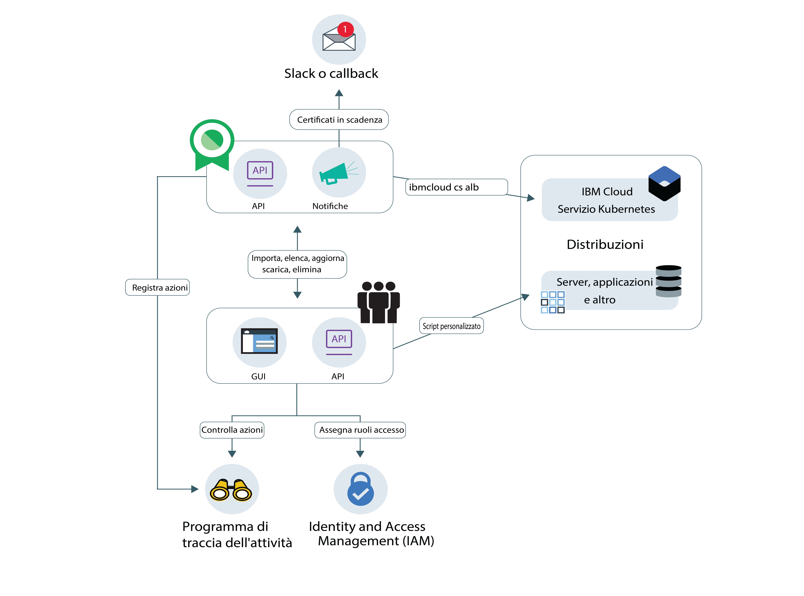

---

copyright:
  years: 2017, 2019
lastupdated: "2019-03-13"

keywords: certificates, SSL, 

subcollection: certificate-manager

---

{:new_window: target="_blank"}
{:shortdesc: .shortdesc}
{:screen: .screen}
{:pre: .pre}
{:table: .aria-labeledby="caption"}
{:codeblock: .codeblock}
{:tip: .tip}
{:note: .note}
{:important: .important}
{:deprecated: .deprecated}
{:download: .download}

# Informazioni su {{site.data.keyword.cloudcerts_short}}
{: #about-certificate-manager}

{{site.data.keyword.cloudcerts_long}} ti aiuta a gestire i certificati SSL per i tuoi servizi e applicazioni basati sul cloud {{site.data.keyword.IBM_notm}}.
{: shortdesc}

Puoi importare i certificati SSL che ottieni per i tuoi servizi e applicazioni, archiviarli in modo sicuro e ottenere una vista centrale dei certificati che stai utilizzando.

Puoi gestire i tuoi certificati nei seguenti modi:

* Ricevi una notifica prima della scadenza dei certificati per assicurarti di rinnovarli in tempo
* Visualizza i tipi di certificati nelle tue distribuzioni e assicurati che soddisfino le politiche dell'organizzazione
* Trova i certificati che devono devono essere sostituiti quando vengono emessi nuovi requisiti di sicurezza o conformità
* Configura i controlli su chi può accedere e gestire i tuoi certificati

<caption>Figura 1. Architettura del servizio di alto livello</caption>

## Sicurezza chiave privata
{: #private-key-security}

Quando importi un certificato e la rispettiva chiave privata in {{site.data.keyword.cloudcerts_short}}, il servizio utilizza un algoritmo AES (Advanced Encryption Standard) 256 per codificare la chiave privata. {{site.data.keyword.cloudcerts_short}} salva questa chiave codificata univoca da utilizzare con la tua istanza del servizio.

## Integrazioni
{: #integrations}

<table>
<caption>Tabella 1. I servizi {{site.data.keyword.cloud_notm}} che utilizzano il {{site.data.keyword.cloudcerts_short}}</caption>
  <tr>
    <th> Servizio </th>
    <th> Descrizione </th>
  </tr>
  <tr>
    <td>{{site.data.keyword.containerlong_notm}}</td>
    <td>Puoi distribuire in modo facile e sicuro i certificati TLS del dominio personalizzati da {{site.data.keyword.cloudcerts_short}} nel tuo cluster Kubernetes. Gli amministratori del cluster possono utilizzare i [comandi del plug-in del servizio IBM Cloud Kubernetes](/docs/containers?topic=containers-cs_cli_reference) per aggiornare i certificati TLS come segreti Kubernetes con un nuovo certificato senza provocare tempi di inattività. Per iniziare, consulta le [annotazioni Ingress nella documentazione](/docs/containers?topic=containers-ingress_annotation#https-auth).</td>
  </tr>
  <tr>
    <td>{{site.data.keyword.security-advisor_full_notm}}</td>
    <td>[{{site.data.keyword.security-advisor_short}}](/docs/services/security-advisor?topic=security-advisor-index) centralizza le informazioni sui servizi {{site.data.keyword.cloud_notm}}. Le informazioni includono l'indicazione dei certificati scaduti e dei certificati che stanno per scadere in istanze del {{site.data.keyword.cloudcerts_short}} nel tuo account {{site.data.keyword.cloud_notm}}. [Ulteriori informazioni su {{site.data.keyword.security-advisor_short}}](/docs/services/security-advisor?topic=security-advisor-index#index).</td>
  </tr>
  <tr>
    <td>{{site.data.keyword.cloudaccesstrailfull_notm}}</td>
    <td>Puoi utilizzare [il servizio {{site.data.keyword.cloudaccesstrailfull_notm}}](/docs/services/cloud-activity-tracker?topic=cloud-activity-tracker-getting-started#getting-started) per tracciare il modo in cui gli utenti e le applicazioni interagiscono con il servizio {{site.data.keyword.cloudcerts_long_notm}} in {{site.data.keyword.cloud_notm}}. [Ulteriori informazioni su {{site.data.keyword.cloudaccesstrailshort}}](/docs/services/cloud-activity-tracker?topic=cloud-activity-tracker-getting-started#getting-started).
    
Per ottenere l'elenco delle azioni che generano un evento, vedi [Eventi di {{site.data.keyword.cloudaccesstrailshort}}](/docs/services/certificate-manager?topic=certificate-manager-at_events#at_events).
</td>
  </tr>
  <tr>
    <td>{{site.data.keyword.cloud_notm}} {{site.data.keyword.apiconnect_short}}</td>
    <td>Archivia i tuoi certificati del dominio personalizzati nel servizio {{site.data.keyword.cloudcerts_short}}, quindi utilizza i CRN del certificato per eseguire il bind a domini personalizzati in {{site.data.keyword.apiconnect_short}}. [Ulteriori informazioni su {{site.data.keyword.apiconnect_short}}](/docs/services/apiconnect?topic=apiconnect-index).
</td>
  </tr>
</table>

## Località
{: #availability}

{{site.data.keyword.cloudcerts_short}} è disponibile nelle località di Dallas, Londra, Francoforte e Tokyo. 

## Limiti
{: #limits}

Puoi caricare un massimo di 1000 certificati per istanza.
