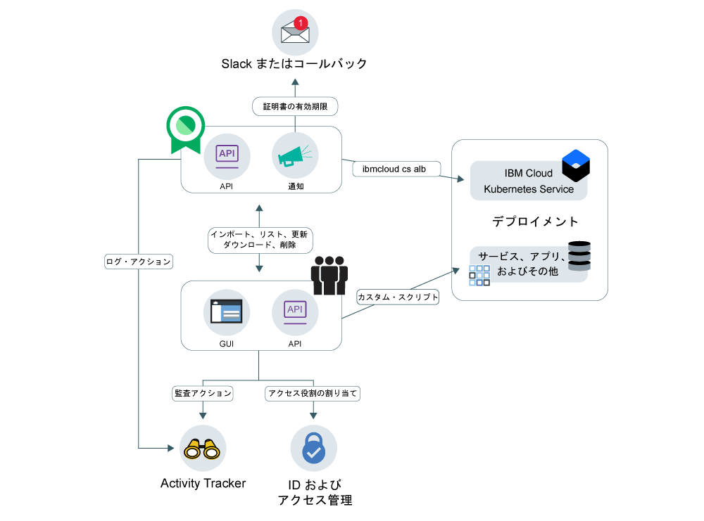

---

copyright:
  years: 2017, 2019
lastupdated: "2019-05-06"

keywords: certificates, SSL,

subcollection: certificate-manager

---

{:new_window: target="_blank"}
{:shortdesc: .shortdesc}
{:screen: .screen}
{:pre: .pre}
{:table: .aria-labeledby="caption"}
{:codeblock: .codeblock}
{:tip: .tip}
{:note: .note}
{:important: .important}
{:deprecated: .deprecated}
{:download: .download}

# {{site.data.keyword.cloudcerts_short}} の概要
{: #about-certificate-manager}

{{site.data.keyword.cloudcerts_full}} は、{{site.data.keyword.IBM_notm}} Cloud ベース・アプリ用の SSL 証明書の取得、保管および管理を支援します。
{: shortdesc}

アプリおよびサービス用に取得する SSL 証明書をインポートし、それらを安全に保管し、使用している証明書を集中して表示することができます。または、サポートされている CA から証明書マネージャーを通して公開証明書を注文することもできます。

証明書は、以下の方法で管理できます。

* 証明書の有効期限が切れる前に通知を受け取り、期限前に更新するようにする  
* 証明書の自動更新をトリガーするために通知を使用する  
* 複数のデプロイメントにわたって証明書のタイプを表示し、それらが組織のポリシーに一致していることを確認する  
* 新しいコンプライアンス要件またはセキュリティー要件が出されたときに置き換える必要がある証明書を見つける  
* 証明書のアクセスおよび管理を行えるユーザーについて制御を設定する
* 新しい公開証明書を注文する

<caption>図 1. 上位サービス・アーキテクチャー。</caption>

## 秘密鍵のセキュリティー
{: #private-key-security}

証明書を {{site.data.keyword.cloudcerts_short}} にインポートおよび注文すると、サービスは Advanced Encryption Standard (AES) 256 アルゴリズムを使用して秘密鍵を暗号化します。{{site.data.keyword.cloudcerts_short}} は、サービス・インスタンスで使用するために、この暗号化された固有鍵を保存します。

## 統合
{: #integrations}

<table>
<caption>表 1. {{site.data.keyword.cloudcerts_short}} を使用する{{site.data.keyword.cloud_notm}} サービス</caption>
  <tr>
    <th> サービス </th>
    <th> 説明 </th>
  </tr>
  <tr>
    <td>{{site.data.keyword.containerlong_notm}}</td>
    <td>カスタム・ドメイン TLS 証明書を {{site.data.keyword.cloudcerts_short}} から Kubernetes クラスターに簡単かつ安全にデプロイできます。 クラスター管理者は [Kubernetes サービス・プラグイン・コマンド](/docs/containers?topic=containers-cs_cli_reference)を使用して、ダウン時間を発生させることなく TLS 証明書を Kubernetes secret として新しい証明書で更新することができます。 開始するには、[ドキュメンテーションの入口コメント](/docs/containers?topic=containers-ingress_annotation#https-auth)をチェックアウトします。</td>
  </tr>
  <tr>
    <td>{{site.data.keyword.security-advisor_full_notm}}</td>
    <td>[{{site.data.keyword.security-advisor_short}}](/docs/services/security-advisor?topic=security-advisor-getting-started#getting-started) は、{{site.data.keyword.cloud_notm}} サービスに関する情報を一元化します。これには、{{site.data.keyword.cloud_notm}} アカウント内の {{site.data.keyword.cloudcerts_short}} のインスタンスで期限切れになった証明書と有効期限が近づいた証明書についての情報が含まれます。 [{{site.data.keyword.security-advisor_short}}の詳細はこちら](/docs/services/security-advisor?topic=security-advisor-getting-started#getting-started)を参照してください。</td>
  </tr>
  <tr>
    <td>{{site.data.keyword.at_short}}</td>
    <td>[{{site.data.keyword.at_short}}](/docs/services/Activity-Tracker-with-LogDNA?topic=logdnaat-getting-started#getting-started)を使用して、{{site.data.keyword.cloud_notm}} でユーザーとアプリケーションが
{{site.data.keyword.cloudcerts_long_notm}} サービスと対話する方法を追跡します。
    
イベントを生成するアクションのリストを取得するには、[{{site.data.keyword.at_short}} イベント](/docs/services/certificate-manager?topic=certificate-manager-at_events#at_events)を参照してください。
</td>
  </tr>
  <tr>
    <td>{{site.data.keyword.cloud_notm}} {{site.data.keyword.apiconnect_short}}</td>
    <td>カスタム・ドメイン証明書を {{site.data.keyword.cloudcerts_short}} サービスに保管し、証明書 CRN を使用して {{site.data.keyword.apiconnect_short}} のカスタム・ドメインにバインドします。 [{{site.data.keyword.apiconnect_short}}の詳細はこちら](/docs/services/apiconnect?topic=apiconnect-index#index)を参照してください。
</td>
  </tr>
</table>

## 可用性
{: #availability}

{{site.data.keyword.cloudcerts_short}} は、ダラス、ロンドン、フランクフルト、東京のロケーションで使用可能です。

## 制限
{: #limits}

1 インスタンスにつき最大 1000 の証明書をアップロードできます。

## コンプライアンスと標準
{: #compliance-and-standards}

{{site.data.keyword.cloudcerts_short}} は、いくつかの認証および監査を完了し、いくつかの重要な基準を満たしています。

### HIPAA
{: #compliance-hippa}

{{site.data.keyword.cloudcerts_short}} は、1996 年の医療保険の積算と責任に関する法律 (HIPAA) のセキュリティー・ルールおよびプライバシー・ルールの条件に見合った、必要な IBM のコントロールを満たしています。

### 国際標準化機構 (ISO)
{: #compliance-iso}

* {{site.data.keyword.IBM_notm}} サービス (PaaS および SaaS) 証明書 - ISO 27001

### 一般データ保護規則 (GDPR)
{: #compliance-gdpr}

GDPR は、EU 全域で調和のとれたデータ保護法の枠組みを作ることを意図しています。GDPR の目標は、世界中のあらゆる場所でこのデータのホスティングと「処理」に厳格な規則を課しながら、市民が自分の個人データを管理する権利を取り戻すことです。また、この規則では、EU 域内と域外における個人データの自由な移動に関するルールが導入されます。詳しくは、[IBM プライバシー・ステートメント](https://www.ibm.com/privacy/)を参照してください。
