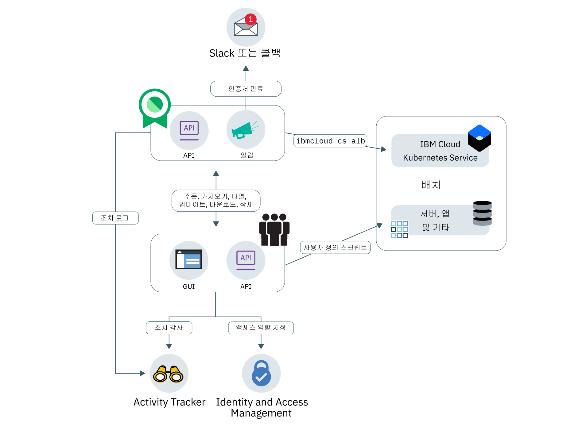

---

copyright:
  years: 2017, 2019
lastupdated: "2019-05-06"

keywords: certificates, SSL,

subcollection: certificate-manager

---

{:new_window: target="_blank"}
{:shortdesc: .shortdesc}
{:screen: .screen}
{:pre: .pre}
{:table: .aria-labeledby="caption"}
{:codeblock: .codeblock}
{:tip: .tip}
{:note: .note}
{:important: .important}
{:deprecated: .deprecated}
{:download: .download}

# {{site.data.keyword.cloudcerts_short}} 정보
{: #about-certificate-manager}

{{site.data.keyword.cloudcerts_full}}는 {{site.data.keyword.IBM_notm}} 클라우드 기반 앱에 대한 SSL 인증서를 얻고, 저장하고, 관리하는 데 도움을 줍니다.
{: shortdesc}

앱 및 서비스에 대해 얻은 SSL 인증서를 가져와서 안전하게 저장하고 사용 중인 인증서를 중앙에서 볼 수 있습니다. 또는 지원되는 CA의 Certificate Manager를 통해 공용 인증서를 주문할 수 있습니다.

다음과 같은 방법으로 인증서를 관리할 수 있습니다.

* 제시간에 인증서를 갱신하는지 확인하도록 인증서가 만료되기 전에 알림을 받습니다.  
* 알림을 사용하여 자동화된 인증서 갱신을 트리거합니다.  
* 배치에서 인증서의 유형을 보고 인증서가 조직 정책을 충족하는지 확인합니다.  
* 새로운 준수 또는 보안 요구사항이 발행될 때 대체해야 하는 인증서를 찾습니다.  
* 인증서에 액세스하고 인증서를 관리할 수 있는 사용자에 대한 제어를 설정합니다.
* 새 공용 인증서를 주문합니다.

<caption>그림 1. 상위 레벨 서비스 아키텍처.</caption>

## 개인 키 보안
{: #private-key-security}

인증서를 {{site.data.keyword.cloudcerts_short}}로 가져오거나 주문할 때 서비스에서 고급 암호화 표준(AES) 256 알고리즘을 사용하여 개인 키를 암호화합니다. {{site.data.keyword.cloudcerts_short}}가 서비스 인스턴스에 사용하도록 이 암호화된 고유 키를 저장합니다.

## 통합
{: #integrations}

<table>
<caption>표 1. {{site.data.keyword.cloudcerts_short}}를 사용하는 {{site.data.keyword.cloud_notm}} 서비스</caption>
  <tr>
    <th> 서비스 </th>
    <th> 설명 </th>
  </tr>
  <tr>
    <td>{{site.data.keyword.containerlong_notm}}</td>
    <td>사용자 정의 도메인 TLS 인증서를 {{site.data.keyword.cloudcerts_short}}에서 Kubernetes 클러스터로 쉽고 안전하게 배치할 수 있습니다. 클러스터 관리자는 작동 중지 시간을 발생시키지 않고 [Kubernetes Service 플러그인 명령](/docs/containers?topic=containers-cs_cli_reference)을 사용하여 TLS 인증서를 Kubernetes 시크릿으로서 새 인증서로 업데이트할 수 있습니다. 시작하려면 [문서의 Ingress 어노테이션](/docs/containers?topic=containers-ingress_annotation#https-auth)을 참조하십시오.</td>
  </tr>
  <tr>
    <td>{{site.data.keyword.security-advisor_full_notm}}</td>
    <td>[{{site.data.keyword.security-advisor_short}}](/docs/services/security-advisor?topic=security-advisor-getting-started#getting-started)는 {{site.data.keyword.cloud_notm}} 서비스에 대한 정보를 중앙에서 관리합니다. 정보에는 {{site.data.keyword.cloud_notm}} 계정의 {{site.data.keyword.cloudcerts_short}} 인스턴스에 있는 만료된 인증서 및 만료 예정인 인증서의 표시가 포함됩니다. [{{site.data.keyword.security-advisor_short}}에 대해 자세히 알아보십시오](/docs/services/security-advisor?topic=security-advisor-getting-started#getting-started).</td>
  </tr>
  <tr>
    <td>{{site.data.keyword.at_short}}</td>
    <td>[{{site.data.keyword.at_short}}](/docs/services/Activity-Tracker-with-LogDNA?topic=logdnaat-getting-started#getting-started)를 사용하여 사용자 및 애플리케이션이 {{site.data.keyword.cloud_notm}}에서 {{site.data.keyword.cloudcerts_long_notm}}의 서비스와 상호작용하는 방식을 추적할 수 있습니다.
    
이벤트를 생성하는 조치의 목록을 가져오려면 [{{site.data.keyword.at_short}} 이벤트](/docs/services/certificate-manager?topic=certificate-manager-at_events#at_events)를 참조하십시오.
</td>
  </tr>
  <tr>
    <td>{{site.data.keyword.cloud_notm}} {{site.data.keyword.apiconnect_short}}</td>
    <td>사용자 정의 도메인 인증서를 {{site.data.keyword.cloudcerts_short}} 서비스에 저장한 후, 인증서 CRN을 사용하여 {{site.data.keyword.apiconnect_short}}의 사용자 정의 도메인과 바인딩하십시오. [{{site.data.keyword.apiconnect_short}}에 대해 자세히 알아보십시오](/docs/services/apiconnect?topic=apiconnect-index#index).
</td>
  </tr>
</table>

## 가용성
{: #availability}

{{site.data.keyword.cloudcerts_short}}는 댈러스, 런던, 프랑크푸르트 및 도쿄 위치에서 사용 가능합니다.

## 한계
{: #limits}

인스턴스당 최대 1000개의 인증서를 업로드할 수 있습니다.

## 규제 준수 및 표준
{: #compliance-and-standards}

{{site.data.keyword.cloudcerts_short}}는 여러 인증서 및 감사를 완료했으며 여러 가지 중요한 표준을 충족합니다.

### HIPAA
{: #compliance-hippa}

{{site.data.keyword.cloudcerts_short}}는 1996년에 제정된 건강보험 이전과 책임에 관한 법(HIPAA)의 보안 및 개인정보처리방침 요구사항에 부합하는 필수 IBM 제어를 충족합니다.

### ISO(International Organization for Standardization)
{: #compliance-iso}

* {{site.data.keyword.IBM_notm}} 서비스(PaaS 및 SaaS) 인증서 - ISO 27001

### 일반 개인정보 보호법률(General Data Protection Regulation)
{: #compliance-gdpr}

GDPR의 목적은 EU 전역에서 통합 데이터 보호 법률 체계를 만들기 위해 노력하며 전세계 어느 곳에서나 개인 데이터를 호스팅하고 '처리'하는 데 엄격한 규칙을 적용하여 이 데이터의 제어 권한을 시민들에게 돌려주는 것을 목표로 합니다. 또한 이 규정은 EU 내부 및 외부에서의 자유로운 개인 데이터 이동과 관련된 규칙을 도입합니다. 자세한 정보는 [IBM 개인정보처리방침](https://www.ibm.com/privacy/kr/ko)을 참조하십시오.
