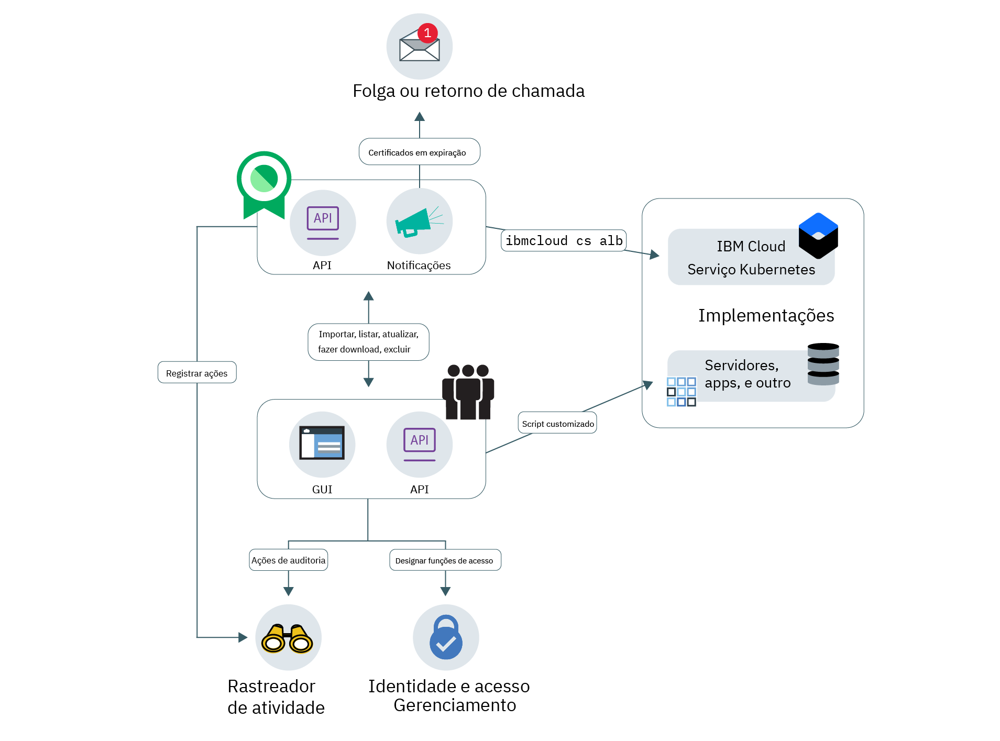

---

copyright:
  years: 2017, 2019
lastupdated: "2019-03-13"

keywords: certificates, SSL, 

subcollection: certificate-manager

---

{:new_window: target="_blank"}
{:shortdesc: .shortdesc}
{:screen: .screen}
{:pre: .pre}
{:table: .aria-labeledby="caption"}
{:codeblock: .codeblock}
{:tip: .tip}
{:note: .note}
{:important: .important}
{:deprecated: .deprecated}
{:download: .download}

# Sobre {{site.data.keyword.cloudcerts_short}}
{: #about-certificate-manager}

O {{site.data.keyword.cloudcerts_long}} ajuda você a gerenciar os certificados SSL para seus aplicativos e serviços
{{site.data.keyword.IBM_notm}} baseados em nuvem.
{: shortdesc}

É possível importar certificados SSL que você obtém para seus aplicativos e serviços, armazená-los de forma segura e obter
uma visualização central dos certificados que você está usando.

É possível gerenciar seus certificados das maneiras a seguir:

* Receba uma notificação antes que seus certificados expirem para assegurar que você os renove a tempo
* Visualize os tipos de certificados em suas implementações e garanta que eles atendam às políticas da organização
* Localize certificados que precisam de substituição quando novos requisitos de conformidade ou segurança são emitidos
* Configure controles sobre quem pode acessar e gerenciar seus certificados

<caption>Figura 1. Arquitetura de serviço de alto nível.</caption>

## Segurança de chave privada
{: #private-key-security}

Ao importar um certificado e a chave privada correspondente para {{site.data.keyword.cloudcerts_short}}, o
serviço usa um algoritmo Advanced Encryption Standard (AES) 256 para criptografar a chave privada. O {{site.data.keyword.cloudcerts_short}} salva essa chave criptografada exclusiva para usar com sua instância de serviço.

## Integrações
{: #integrations}

<table>
<caption>Tabela 1. Serviços do {{site.data.keyword.cloud_notm}} que usam o {{site.data.keyword.cloudcerts_short}}</caption>
  <tr>
    <th> Service </th>
    <th> Descrição </th>
  </tr>
  <tr>
    <td>{{site.data.keyword.containerlong_notm}}</td>
    <td>É possível implementar certificados TLS de domínio customizado de maneira fácil e segura por meio do {{site.data.keyword.cloudcerts_short}} em seu cluster Kubernetes. Os administradores de cluster podem usar os [comandos de plug-in do Serviço Kubernetes](/docs/containers?topic=containers-cs_cli_reference) para atualizar certificados TLS como segredos do Kubernetes com um novo certificado, sem causar tempo de inatividade. Para começar, consulte as [Anotações de ingresso na documentação](/docs/containers?topic=containers-ingress_annotation#https-auth).</td>
  </tr>
  <tr>
    <td>{{site.data.keyword.security-advisor_full_notm}}</td>
    <td>O [{{site.data.keyword.security-advisor_short}}](/docs/services/security-advisor?topic=security-advisor-index) centraliza as informações sobre os serviços do {{site.data.keyword.cloud_notm}}. As informações incluem a indicação de certificados expirados e certificados que estão prestes a expirar em instâncias do {{site.data.keyword.cloudcerts_short}} em sua conta do {{site.data.keyword.cloud_notm}}. [Saiba mais sobre o {{site.data.keyword.security-advisor_short}}](/docs/services/security-advisor?topic=security-advisor-index#index).</td>
  </tr>
  <tr>
    <td>{{site.data.keyword.cloudaccesstrailfull_notm}}</td>
    <td>É possível usar [o serviço {{site.data.keyword.cloudaccesstrailfull_notm}}](/docs/services/cloud-activity-tracker?topic=cloud-activity-tracker-getting-started#getting-started) para controlar como os usuários e os aplicativos interagem com o serviço {{site.data.keyword.cloudcerts_long_notm}} no {{site.data.keyword.cloud_notm}}. [Saiba mais sobre o {{site.data.keyword.cloudaccesstrailshort}}](/docs/services/cloud-activity-tracker?topic=cloud-activity-tracker-getting-started#getting-started).
    
Para obter a lista de ações que geram um evento, consulte [Eventos do {{site.data.keyword.cloudaccesstrailshort}}](/docs/services/certificate-manager?topic=certificate-manager-at_events#at_events).
</td>
  </tr>
  <tr>
    <td>{{site.data.keyword.cloud_notm}} {{site.data.keyword.apiconnect_short}}</td>
    <td>Armazene os certificados de domínio customizado no serviço do {{site.data.keyword.cloudcerts_short}} e, em seguida, use os CRNs de certificado para ligar-se aos domínios customizados no {{site.data.keyword.apiconnect_short}}. [Saiba mais sobre o {{site.data.keyword.apiconnect_short}}](/docs/services/apiconnect?topic=apiconnect-index).
</td>
  </tr>
</table>

## Localidades
{: #availability}

O {{site.data.keyword.cloudcerts_short}} está disponível nos locais de Dallas, Londres, Frankfurt e Tóquio.

## Limites
{: #limits}

É possível fazer upload de 1.000 certificados por instância, no máximo.
