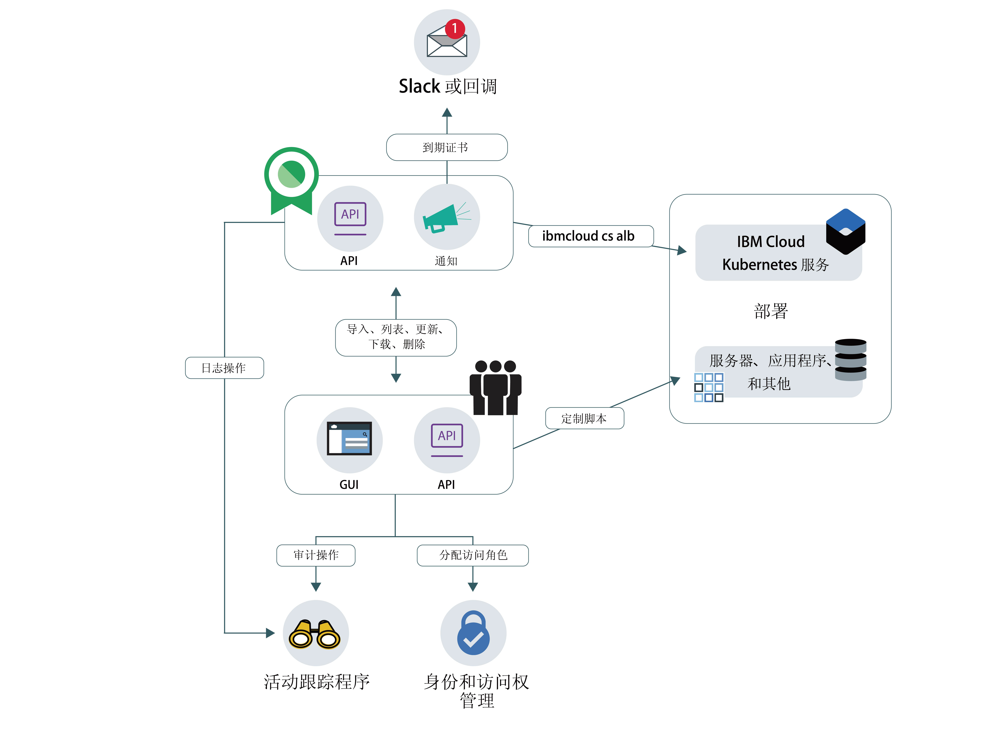

---

copyright:
  years: 2017, 2019
lastupdated: "2019-07-09"

keywords: certificates, SSL,

subcollection: certificate-manager

---

{:external: target="_blank" .external}
{:shortdesc: .shortdesc}
{:screen: .screen}
{:pre: .pre}
{:table: .aria-labeledby="caption"}
{:codeblock: .codeblock}
{:tip: .tip}
{:note: .note}
{:important: .important}
{:deprecated: .deprecated}
{:download: .download}

# 关于 {{site.data.keyword.cloudcerts_short}}
{: #about-certificate-manager}

{{site.data.keyword.cloudcerts_full}} 可帮助您获取、存储和管理 SSL 证书以用于 {{site.data.keyword.cloud_notm}} 部署或其他云部署和内部部署。
{: shortdesc}

您可以导入为应用程序和服务获取的 SSL 证书，安全地存储它们并集中查看正在使用的证书。或者，您可以通过 Certificate Manager 向支持的 CA 订购公用证书。

您可以通过以下方式来管理您的证书：

* 在证书到期之前收到通知，以确保您可按时更新  
* 使用通知触发证书自动更新  
* 跨部署查看证书的类型并确保它们满足组织策略  
* 发出新合规性或安全性需求时，查找需要替换的证书  
* 控制谁可以访问和管理证书
* 订购新的公用证书

<caption>图 1. 高级服务体系结构。</caption>

## 专用密钥安全性
{: #private-key-security}

将证书导入到 {{site.data.keyword.cloudcerts_short}} 或在其中订购证书时，该服务将使用高级加密标准 (AES) 256 算法来加密专用密钥。{{site.data.keyword.cloudcerts_short}} 会保存此唯一加密密钥以使用服务实例。

## 集成
{: #integrations}

<table>
<caption>表 1. 使用 {{site.data.keyword.cloudcerts_short}} 的 {{site.data.keyword.cloud_notm}} 服务</caption>
  <tr>
    <th> 服务</th>
    <th> 描述</th>
  </tr>
  <tr>
    <td>{{site.data.keyword.containerlong_notm}}</td>
    <td>您可以轻松且安全地将定制域证书 TLS 证书从 {{site.data.keyword.cloudcerts_short}} 部署到 Kubernetes 集群。集群管理员可使用 [Kubernetes Service 插件命令](/docs/containers?topic=containers-cli-plugin-kubernetes-service-cli)以用新证书将 TLS 证书更新为 Kubernetes 密钥，而不会导致停机时间。要开始，请查看[文档中的 Ingress 注释](/docs/containers?topic=containers-ingress_annotation#https-auth)。</td>
  </tr>
  <tr>
    <td>{{site.data.keyword.security-advisor_full_notm}}</td>
    <td>[{{site.data.keyword.security-advisor_short}}](/docs/services/security-advisor?topic=security-advisor-getting-started#getting-started) 会集中管理有关 {{site.data.keyword.cloud_notm}} 服务的信息。这些信息包括到期证书以及您 {{site.data.keyword.cloud_notm}} 帐户下 {{site.data.keyword.cloudcerts_short}} 实例中即将到期证书的相关指示信息。[了解有关 {{site.data.keyword.security-advisor_short}} 的更多信息](/docs/services/security-advisor?topic=security-advisor-getting-started#getting-started)。</td>
  </tr>
  <tr>
    <td>{{site.data.keyword.at_short}}</td>
    <td>您可以使用 [{{site.data.keyword.at_short}}](/docs/services/Activity-Tracker-with-LogDNA?topic=logdnaat-getting-started#getting-started) 来跟踪用户和应用程序如何与 {{site.data.keyword.cloud_notm}} 中的 {{site.data.keyword.cloudcerts_long_notm}} 服务进行交互。
    
要获取用于生成事件的操作的列表，请参阅 [{{site.data.keyword.at_short}} 事件](/docs/services/certificate-manager?topic=certificate-manager-at_events#at_events)。
</td>
  </tr>
  <tr>
    <td>{{site.data.keyword.cloud_notm}} {{site.data.keyword.apiconnect_short}}</td>
    <td>将您的定制域证书存储在 {{site.data.keyword.cloudcerts_short}} 服务中，然后使用服务 CRN 与 {{site.data.keyword.apiconnect_short}} 中的定制域进行绑定。[了解有关 {{site.data.keyword.apiconnect_short}}](/docs/services/apiconnect?topic=apiconnect-index#index) 的更多信息。
</td>
  </tr>
</table>

## 可用性
{: #availability}

{{site.data.keyword.cloudcerts_short}} 在达拉斯、伦敦、法兰克福和东京位置中可用。

## 限制
{: #limits}

每个实例最多可上传 1000 个证书。

## 合规性与标准
{: #compliance-and-standards}

{{site.data.keyword.cloudcerts_short}} 已成功完成多项证书和审计，并符合多种重要标准。

### HIPAA
{: #compliance-hippa}

{{site.data.keyword.cloudcerts_short}} 满足必需的 IBM 控制措施，这些措施与 1996 年颁布的健康保险可移植性和责任法案 (HIPAA) 中的安全和隐私规则要求相一致。

### 国际标准化组织 (ISO)
{: #compliance-iso}

* {{site.data.keyword.IBM_notm}} 服务（PaaS 和 SaaS）证书 - ISO 27001

### 一般数据保护条例 (GDPR)
{: #compliance-gdpr}

GDPR 致力于在整个欧盟建立协调的数据保护法律框架，目标是让公民重获对个人数据的控制权，同时对世界各地托管和“处理”这些数据的组织实施严格的规则。该条例还引入了与欧盟境内和境外个人数据自由流通相关的规则。有关更多信息，请参阅 [IBM 隐私声明](https://www.ibm.com/privacy/)。
