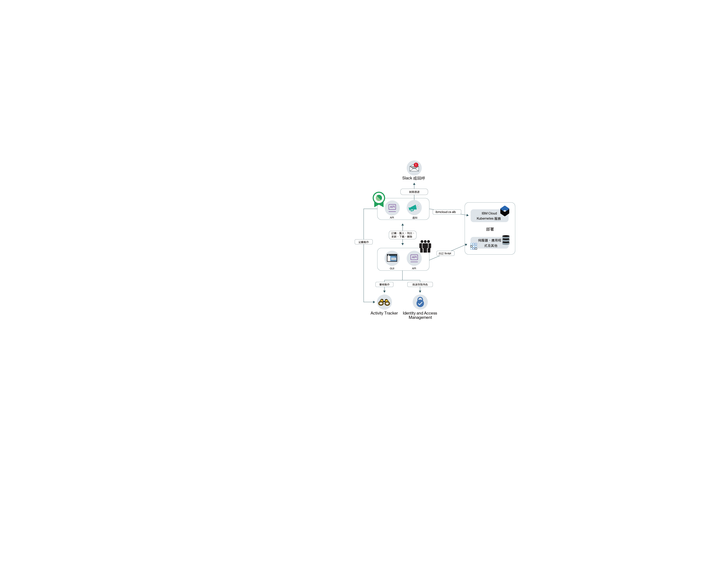

---

copyright:
  years: 2017, 2019
lastupdated: "2019-03-13"

keywords: certificates, SSL, 

subcollection: certificate-manager

---

{:new_window: target="_blank"}
{:shortdesc: .shortdesc}
{:screen: .screen}
{:pre: .pre}
{:table: .aria-labeledby="caption"}
{:codeblock: .codeblock}
{:tip: .tip}
{:note: .note}
{:important: .important}
{:deprecated: .deprecated}
{:download: .download}

# 關於 {{site.data.keyword.cloudcerts_short}}
{: #about-certificate-manager}

{{site.data.keyword.cloudcerts_long}} 可協助您管理 {{site.data.keyword.IBM_notm}} 雲端型應用程式及服務的 SSL 憑證。
{: shortdesc}

您可以匯入針對應用程式及服務取得的 SSL 憑證、安全地儲存它們，以及取得所要使用憑證的中央視圖。

您可以使用下列方式管理憑證：

* 在憑證到期之前收到通知，以確保您準時更新
* 檢視部署中的憑證類型，並確定它們符合組織原則
* 尋找在發出新相符性或安全需求時需要取代的憑證
* 設定您可存取及管理憑證的控制項

<caption>圖 1. 高階服務架構。</caption>

## 私密金鑰安全
{: #private-key-security}

當您將憑證及對應私密金鑰匯入至 {{site.data.keyword.cloudcerts_short}} 時，服務會使用「進階加密標準 (AES) 256」演算法來加密私密金鑰。{{site.data.keyword.cloudcerts_short}} 會儲存這個唯一加密金鑰，以與服務實例搭配使用。

## 整合
{: #integrations}

<table>
<caption>表 1. 使用 {{site.data.keyword.cloudcerts_short}} 的 {{site.data.keyword.cloud_notm}} 服務</caption>
  <tr>
    <th> 服務</th>
    <th> 說明</th>
  </tr>
  <tr>
    <td>{{site.data.keyword.containerlong_notm}}</td>
    <td>您可以輕鬆又安全地將 {{site.data.keyword.cloudcerts_short}} 的自訂網域 TLS 憑證部署至您的 Kubernetes 叢集。叢集管理者可以使用 [Kubernetes 服務外掛程式指令](/docs/containers?topic=containers-cs_cli_reference)以新憑證將 TLS 憑證更新為 Kubernetes 密碼，而不會造成運作中斷。若要開始使用，請查閱[文件中的 Ingress 註釋](/docs/containers?topic=containers-ingress_annotation#https-auth)。</td>
  </tr>
  <tr>
    <td>{{site.data.keyword.security-advisor_full_notm}}</td>
    <td>[{{site.data.keyword.security-advisor_short}}](/docs/services/security-advisor?topic=security-advisor-index) 會集中 {{site.data.keyword.cloud_notm}} 服務的相關資訊。資訊會指出在您的 {{site.data.keyword.cloud_notm}} 帳戶中，{{site.data.keyword.cloudcerts_short}} 實例的已過期憑證和即將過期憑證。[進一步瞭解 {{site.data.keyword.security-advisor_short}}](/docs/services/security-advisor?topic=security-advisor-index#index)。
    </td>
  </tr>
  <tr>
    <td>{{site.data.keyword.cloudaccesstrailfull_notm}}</td>
    <td>您可以使用 [{{site.data.keyword.cloudaccesstrailfull_notm}} 服務](/docs/services/cloud-activity-tracker?topic=cloud-activity-tracker-getting-started#getting-started)以追蹤使用者及應用程式與 {{site.data.keyword.cloud_notm}} 中的 {{site.data.keyword.cloudcerts_long_notm}} 服務互動的情形。[進一步瞭解 {{site.data.keyword.cloudaccesstrailshort}}](/docs/services/cloud-activity-tracker?topic=cloud-activity-tracker-getting-started#getting-started)。
    
若要取得產生事件的動作清單，請參閱 [{{site.data.keyword.cloudaccesstrailshort}} 事件](/docs/services/certificate-manager?topic=certificate-manager-at_events#at_events)。
</td>
  </tr>
  <tr>
    <td>{{site.data.keyword.cloud_notm}} {{site.data.keyword.apiconnect_short}}</td>
    <td>請將您的自訂網域憑證儲存在 {{site.data.keyword.cloudcerts_short}} 服務，然後使用憑證 CRN 在 {{site.data.keyword.apiconnect_short}} 中與自訂網域連結。[進一步瞭解 {{site.data.keyword.apiconnect_short}}](/docs/services/apiconnect?topic=apiconnect-index)。
    
</td>
  </tr>
</table>

## 位置
{: #availability}

{{site.data.keyword.cloudcerts_short}} 提供於達拉斯、倫敦、法蘭克福及東京等位置。

## 限制
{: #limits}

每個實例可以上傳最多 1000 個憑證。
