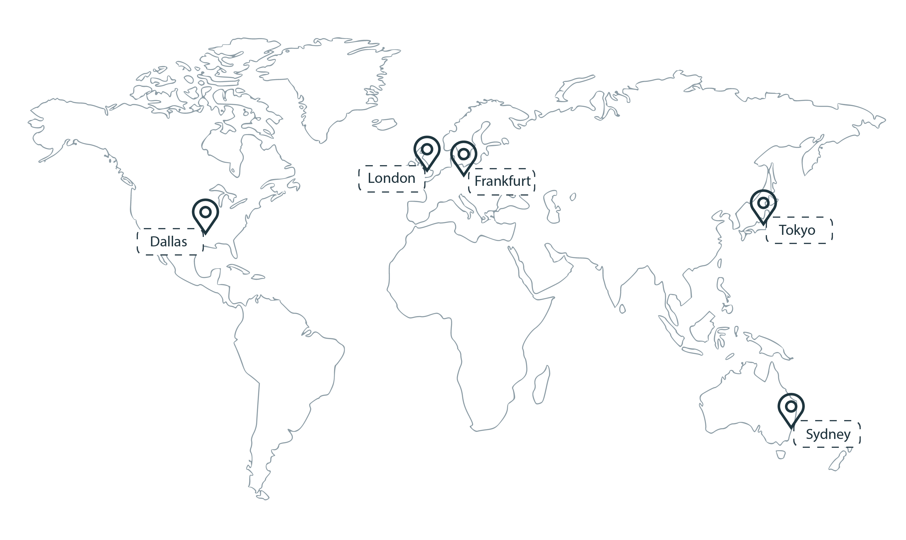

---

copyright:
  years: 2017, 2020
lastupdated: "2020-03-19"

keywords: certificates, ssl, tls, new, sydney, exact search, dns provider, lets encrypt, renew certificate, order certificates

subcollection: certificate-manager

---

{:codeblock: .codeblock}
{:screen: .screen}
{:download: .download}
{:external: target="_blank" .external}
{:new_window: target="_blank"}
{:faq: data-hd-content-type='faq'}
{:gif: data-image-type='gif'}
{:important: .important}
{:note: .note}
{:pre: .pre}
{:tip: .tip}
{:preview: .preview}
{:deprecated: .deprecated}
{:shortdesc: .shortdesc}
{:support: data-reuse='support'}
{:script: data-hd-video='script'}
{:table: .aria-labeledby="caption"}
{:troubleshoot: data-hd-content-type='troubleshoot'}
{:help: data-hd-content-type='help'}
{:tsCauses: .tsCauses}
{:tsResolve: .tsResolve}
{:tsSymptoms: .tsSymptoms}

# Regions and endpoints
{: #regions-endpoints}

Review region and connectivity options for interacting with {{site.data.keyword.cloudcerts_long}}.

## Available regions
{: #regions}

{{site.data.keyword.cloudcerts_short}} is available in the following regions:

{: caption="Figure 1. {{site.data.keyword.cloudcerts_short}} availability" caption-side="bottom"}

## Connectivity options
{: #connectivity}

By default, you can connect to resources in your account over the {{site.data.keyword.cloud_notm}} public network. Your data is encrypted in transit by using the Transport Security Layer (TLS) 1.2 protocol.

## Service endpoints
{: #endpoints}

If you are managing your certificates programmatically, see the following table to determine the API endpoints to use when you connect to the {{site.data.keyword.cloudcerts_short}} API.

| Region    | Public endpoints                             |
|-----------|----------------------------------------------|
| Dallas    | `us-south.certificate-manager.cloud.ibm.com` |
| London    | `eu-gb.certificate-manager.cloud.ibm.com`    |
| Frankfurt | `eu-de.certificate-manager.cloud.ibm.com`    |
| Tokyo     | `jp-tok.certificate-manager.cloud.ibm.com`   |
| Sydney    | `au-syd.certificate-manager.cloud.ibm.com`   |
