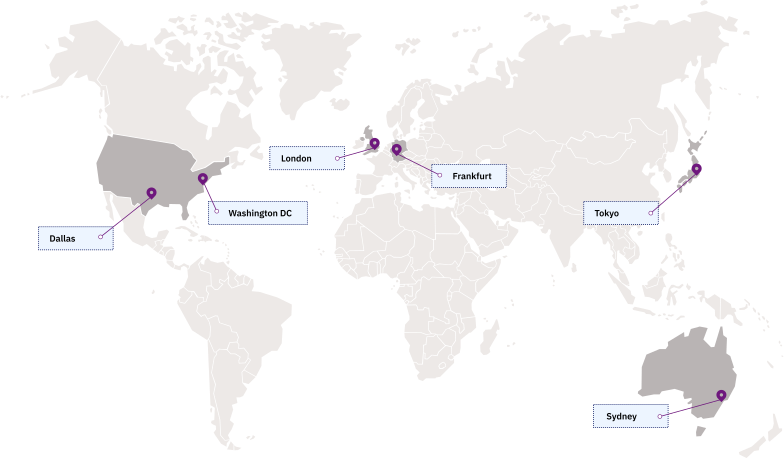

---

copyright:
  years: 2017, 2020
lastupdated: "2020-06-15"

keywords: certificates, ssl, tls, new, sydney, exact search, dns provider, lets encrypt, renew certificate, order certificates

subcollection: certificate-manager

---

{:codeblock: .codeblock}
{:screen: .screen}
{:download: .download}
{:external: target="_blank" .external}
{:new_window: target="_blank"}
{:faq: data-hd-content-type='faq'}
{:gif: data-image-type='gif'}
{:important: .important}
{:note: .note}
{:pre: .pre}
{:tip: .tip}
{:preview: .preview}
{:deprecated: .deprecated}
{:shortdesc: .shortdesc}
{:support: data-reuse='support'}
{:script: data-hd-video='script'}
{:table: .aria-labeledby="caption"}
{:troubleshoot: data-hd-content-type='troubleshoot'}
{:help: data-hd-content-type='help'}
{:tsCauses: .tsCauses}
{:tsResolve: .tsResolve}
{:tsSymptoms: .tsSymptoms}

# Regions and endpoints
{: #regions-endpoints}

Review region and connectivity options for interacting with {{site.data.keyword.cloudcerts_long}}.

## Available regions
{: #regions}

{{site.data.keyword.cloudcerts_short}} is available in the following regions:

{: caption="Figure 1. {{site.data.keyword.cloudcerts_short}} availability" caption-side="bottom"}

## Connectivity options
{: #connectivity}

{{site.data.keyword.cloudcerts_short}} offers two connectivity options for interacting with its service APIs.

<dl>
  <dt>Public endpoints</dt>
    <dd>By default, you can connect to resources in your account over the {{site.data.keyword.cloud_notm}} public network. Your data is encrypted in transit by using the Transport Security Layer (TLS) 1.2 protocol.
    </dd>
  <dt>Private endpoints</dt>
    <dd>For added benefits, you can also enable [virtual routing and forwarding (VRF) and service endpoints](/docs/account?topic=account-vrf-service-endpoint) for your IBM Cloud account. When you enable VRF for your account, you can connect to {{site.data.keyword.cloudcerts_short}} by using a private IP that is accessible only through the {{site.data.keyword.cloud_notm}} private network. To learn more about VRF, see [Virtual routing and forwarding on {{site.data.keyword.cloud_notm}}](/docs/direct-link?topic=direct-link-overview-of-virtual-routing-and-forwarding-vrf-on-ibm-cloud).
    </dd>
</dl>

## Service endpoints
{: #endpoints}

If you are managing your certificates programmatically, see the following table to determine the API endpoints to use when you connect to the {{site.data.keyword.cloudcerts_short}} API.

| Region        | Endpoint                                     |
| ------------- | -------------------------------------------- |
| Dallas        | `us-south.certificate-manager.cloud.ibm.com` |
| Washington DC | `us-east.certificate-manager.cloud.ibm.com`  |
| London        | `eu-gb.certificate-manager.cloud.ibm.com`    |
| Frankfurt     | `eu-de.certificate-manager.cloud.ibm.com`    |
| Tokyo         | `jp-tok.certificate-manager.cloud.ibm.com`   |
| Sydney        | `au-syd.certificate-manager.cloud.ibm.com`   |
{: caption="Table 1. Lists public endpoints for interacting with {{site.data.keyword.cloudcerts_short}} APIs over {{site.data.keyword.cloud_notm}}'s public network" caption-side="top"}
{: #private-endpoints}
{: tab-title="Public"}
{: tab-group="service-endpoints"}
{: class="simple-tab-table"}

| Region        | Endpoint                                             |
| ------------- | ---------------------------------------------------- |
| Dallas        | `private.us-south.certificate-manager.cloud.ibm.com` |
| Washington DC | `private.us-east.certificate-manager.cloud.ibm.com`  |
| London        | `private.eu-gb.certificate-manager.cloud.ibm.com`    |
| Frankfurt     | `private.eu-de.certificate-manager.cloud.ibm.com`    |
| Tokyo         | `private.jp-tok.certificate-manager.cloud.ibm.com`   |
| Sydney        | `private.au-syd.certificate-manager.cloud.ibm.com`   |
{: caption="Table 1a. Lists private endpoints for interacting with {{site.data.keyword.cloudcerts_short}} APIs over {{site.data.keyword.cloud_notm}}'s private network" caption-side="top"}
{: #public-endpoints}
{: tab-title="Private"}
{: tab-group="service-endpoints"}
{: class="simple-tab-table"}

In the Frankfurt region only, certificates are maintained in the service database over the public network.
{: note} 
